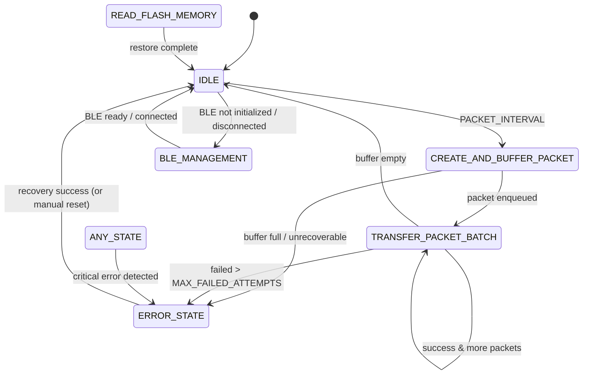

# System Architecture

This document explains the high-level design and component structure of the **IoT Sensor System**, including both the Sensor Unit (Arduino Uno WiFi Rev 4) and the Central Hub (ESP32).

The architecture ensures reliable, real-time data acquisition, BLE communication, and secure HTTP transmission to a backend.

---

## 1. Sensor Unit (Arduino Uno WiFi Rev 4)

### Modules & Responsibilities

* **DHT_handler**: Reads temperature and humidity from the DHT11 sensor.
* **Sensor_package_manager**: Creates `SensorPacket` objects containing sensor data.
* **Bluetooth_manager**: Manages BLE service and characteristics; advertises sensor data and sends notifications.
* **Buffer_manager**: Implements a circular buffer to queue unsent packets and prevent data loss.
* **Sensor_state_manager**: Implements a state machine that controls the sensor’s reading, packet creation, buffering, and BLE transmission.
* **Main Loop**: Continuously runs the state machine and handles BLE transmission logic.

### State Machine (detailed)

The sensor unit uses a deterministic state machine to separate concerns and
to make the device behaviour explicit and testable. The implementation lives
in `src_package_arduino/include/sensor_state_manager.h` and
`src_package_arduino/src/sensor_state_manager.cpp`.

States
* IDLE — waiting for timers or external triggers; no heavy work should execute here.
* CREATE_AND_BUFFER_PACKET — sample sensors, assemble a `SensorPacket` and enqueue it
	into the circular buffer (`buffer_manager`). Uses `assembleSensorPacket()`.
* TRANSFER_PACKET_BATCH — attempt to send the next buffered packet via BLE using a
	peek/commit pattern: `peekPacketFromBuffer()` -> write BLE characteristic -> on
	success `commitPacketRemoval()`; on transient failure retry up to
	`MAX_FAILED_ATTEMPTS` then escalate.
* BLE_MANAGEMENT — ensure BLE stack lifecycle (advertise, accept connections,
	re-advertise on disconnect). Keep this state lightweight and idempotent.
* READ_FLASH_MEMORY — reserved for restoring queued packets or config after
	boot/power-loss. Placeholder in current implementation.
* ERROR_STATE — collect diagnostics and perform safe recovery or await manual
	intervention.

Transition table (high level)
| From State | Trigger / Condition | To State | Notes |
|---|---|---|---|
| IDLE | Packet interval elapsed | CREATE_AND_BUFFER_PACKET | Controlled by `PACKET_INTERVAL` timer |
| CREATE_AND_BUFFER_PACKET | Packet assembled and enqueued | IDLE or TRANSFER_PACKET_BATCH | Depending on policy/timing |
| CREATE_AND_BUFFER_PACKET | Buffer full / unrecoverable failure | ERROR_STATE | Call `transitionToErrorState()` |
| IDLE / BLE_MANAGEMENT | Central connected & buffer has data & transfer timer | TRANSFER_PACKET_BATCH | Controlled by `TRANSFER_PERIOD` |
| TRANSFER_PACKET_BATCH | BLE write success | commit & continue or IDLE | Commit removes packet from buffer |
| TRANSFER_PACKET_BATCH | BLE repeated failure > MAX_FAILED_ATTEMPTS | ERROR_STATE | Save previous state for recovery |
| Any | Critical error detected | ERROR_STATE | Error handler may attempt recovery |

Timing and invariants
* Sampling cadence: `PACKET_INTERVAL` controls when new sensor samples should be created.
* Transfer cadence: `TRANSFER_PERIOD` and `TRANSFER_INTERVAL` control how often transfers
	are attempted and spacing between individual packets respectively.
* Buffer contract: use peek/commit pattern — peek leaves packet in buffer for retries; commit
	removes it only on confirmed success. `queue_count`, `queue_head`, and `queue_tail`
	must remain consistent (see `buffer_manager` docs for invariants).

Error handling and recovery
* Transient failures (temporary BLE unavailability, single read failure) should be retried
	within the same state where safe.
* Repeated failures escalate to `ERROR_STATE` where diagnostics are logged and safe recovery
	steps may run. `previous_state_to_error_state` records where the error originated.
* For persistent buffer overflow, either increase `QUEUE_SIZE` or implement persistence to flash
	(not currently implemented).

Testing and debugging tips
* Use the `native` test environment (sensor project `env:native`) to unit-test `determineSensorState()`
	and state transitions.
* Enable verbose thread-safe serial logs to trace transitions and failure counters.
* Use the broker's logging (`broker_task` / `backend_task`) to verify packet delivery and JSON mapping.

### State Machine Diagram

Below are two representations of the sensor unit state machine: a Mermaid diagram (rendered on GitHub and many Markdown viewers) and an ASCII-art fallback for environments that don't render Mermaid.

Mermaid (preferred):



ASCII art (fallback):

```
			+----------------+
			|      IDLE      |
			+----------------+
			 ^    ^        ^
			 |    |        |
  PACKET_INTERVAL |   BLE not init |
			 |    |        |
 +----------------+ |        |
 | CREATE_AND_BUFFER|        |
 |     _PACKET_    |-------->|
 +-----------------+         |
		|    |                |
		|    | packet enqueued |
		|    v                |
		| +----------------+  |
		| | TRANSFER_PACKET|<- |
		| |    _BATCH_     |   |
		| +----------------+   |
		|    |   ^   |         |
		|    |   |   |         |
		|    v   |   v         |
		|  (success)  (fail)   |
		+-----> IDLE   ---> ERROR_STATE
```

Notes:
* The Mermaid diagram is the recommended view if your Markdown renderer supports it (GitHub does). The ASCII diagram is an easy-to-read fallback for simple viewers or plain-text contexts.
* Keep the diagram in sync with `src_package_arduino/include/sensor_state_manager.h` if you update states or transitions.

### Data Flow

1. Read temperature and humidity via `DHT_handler`.
2. Assemble a `SensorPacket` with `Sensor_package_manager`.
3. Place packet into `Buffer_manager` circular buffer.
4. Send packet via BLE using `Bluetooth_manager` when connected.

---

## 2. Central Hub (ESP32)

### Modules & Responsibilities

* **Backend_task**: Processes incoming sensor packets and formats them into JSON for the backend.
* **Broker_task**: Handles BLE scanning, connecting to sensors, and subscribing to notifications.
* **Networkstatus_task**: Monitors Wi-Fi connectivity and triggers automatic reconnection if necessary.
* **Httptransmission_task**: Sends JSON data to the backend server via HTTPS.
* **Threadsafe Serial Utilities**: Ensures safe logging from multiple FreeRTOS tasks to prevent serial conflicts.

### Data Flow

1. BLE scan for sensor advertisements via `Broker_task`.
2. Subscribe to sensor notifications and enqueue packets into `dataQueue`.
3. `Backend_task` converts `SensorPacket` to JSON and pushes it to `networkQueue`.
4. `Httptransmission_task` reads from `networkQueue` and sends HTTPS requests to the backend.
5. `Networkstatus_task` monitors Wi-Fi connection; triggers reconnects if disconnected.

---

## 3. Communication & Reliability Features

* **BLE Notifications**: Used for sensor-to-hub communication, reducing the need for constant polling.
* **Circular Buffers**: Prevent data loss when multiple packets arrive faster than they can be transmitted.
* **State Machine Logic**: Ensures sensors operate in a controlled and recoverable manner.
* **Thread-safe Logging**: Multiple tasks can log simultaneously without interfering with each other.
* **Backend JSON Conversion**: Ensures consistent payload format for HTTPS transmission.
* **Automatic Reconnection**: Wi-Fi and BLE reconnection handled automatically to maximize uptime.

---

## Notes & Best Practices

* Ensure consistent `SensorPacket` structure between Sensor Unit and Central Hub. Any changes require updates in both [`sensor_package_manager.h`](../src_package_arduino/include/sensor_package_manager.h) and [`sensor_packet_from_sensor.h`](../src_broker_esp32/include/sensor_packet_from_sensor.h).
* Verify BLE UUIDs (`SENSOR_SERVICE_UUID` and `SENSOR_CHAR_UUID`) match between the Arduino and ESP32.
* Adjust queue sizes (`dataQueue` and `networkQueue`) in ESP32 if packet drop is observed under high sensor frequency.
* Use serial monitor and thread-safe utilities to debug runtime behavior on ESP32.
* Doxygen comments in source files can be used to generate developer reference documentation.

---

This architecture provides a robust, modular system separating sensor acquisition, BLE communication, and backend transmission, while enabling maintainability and scalability.
